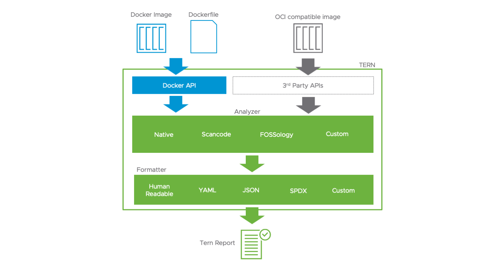
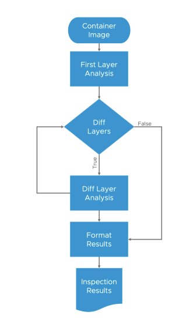

# Tern Architecture

You may want to look at the [glossary](./glossary.md) to understand the terms being used.

## Overall Approach
Tern uses a "container aware" approach to analyze container images. Tern tries to find the tool or method used to install software components in the container and will use equivalent debugging methods to find the status of said software component. This involves mounting the overlay filesystem and running commands against it at the most basic level. The results of the shell commands are then collated into a nice report showing which container layers brought in what packages. Tern is also built to be a tool for guidance and hence will point out any missing or unknown information. For example, if it cannot find information about licenses, it will inform you of this or nudge you to either add information about it or a shell script to retrieve it.

Tern can also use license file scanners to scan container images. This is not the "container aware" approach that the native analyzer uses. Instead Tern will just run the scanners on the filesystems in the container image. This approach works for current container distribution methods as all the layers are "pushed" to the container registry's repository belonging to the originator. As a result, the originator is obligated to provide sources for software components included in all layers. This is not the case for security scanning as the files at the lower layers may be patched in the later layers, thus invalidating the results from the lower layers. However, this doesn't stop you from using a security scanner on the container image.

## Guiding Principles
1. OSS Compliance First: Tern is a compliance tool at heart. Hence whatever it does is meant to help the user meet their open source compliance obligations, or, at the minimum, make them aware of the licenses governing the open source software they use.
2. Be Transparent: Tern will report on everything it is doing in order to not mislead on how it got its information. This allows Engineers to ascertain confidence in the results themselves.
3. Inform not Ignore: Tern will report on all exceptions it has encountered during the course of its execution. This, again, is to allow Engineers to make assessments on the efficacy of the tool, the results and the container image itself. 

## Layout

Here is a general architecture diagram:

There are 4 components that operate together:

### The Cache
This is the database where filesystem identifiers can be queried against to retrieve package information. This is useful as many containers are based on other container images. If Tern had come across the same filesystem in another container, it can retrieve the package information without spinning up a container. Tern looks for filesystems here before doing any analysis. This is Tern's own data store which can be curated and culled over time. The reason that Tern keeps its own data store is because the filesystem artifacts that make up a container image are not necessarily how other compliance databases store license information. The filesystems also follow their own method of identifying themselves. A container build is not reproducible, so often, even when the content of the filesystem has not changed, the container's checksum has and that makes it difficult to identify the contents of a container image.

### The Command Library
This is a database of shell commands that may be used to create a container's layer filesystem. There are two types of shell commands - one for system wide package managers and one for custom shell commands or install scripts. The library is split in this way to account for situations where whole root filesystems are imported in order to create a new container.

For example, in [this Dockerfile sample](../samples/debian_vim/Dockerfile), the use of FROM debian:jessie imports the base debian:jessie image from Dockerhub. This image is in turn created with a [Dockerfile](https://github.com/debuerreotype/docker-debian-artifacts/blob/b024a792c752a5c6ccc422152ab0fd7197ae8860/jessie/Dockerfile) that has the FROM scratch directive and adds an entire root filesystem created from an external build an release pipeline not related to Docker. The base library is meant to keep track of such images. On the other hand, the snippets library is used to keep track of standalone shell commands that can be used to install packages, once you have a base image to work on.

Some acknowledgement should be made here that this is not the only way to create a container. However, it seems to be the most prevalent way right now. In the future, the community may move away from the Copy on Write filesystems and instead use one filesystem. If this were the case, Tern's job might be a bit easier, but this is just speculation.

When Tern uses an external file scanner, it bypasses the command library altogether and instead relies on the external tool's results. The approach allows Engineers to compare results from different tools available to them as they have always done, but on container images.

### The Analyzer
At a conceptual level, the Analyzer is what unbundles a container image, reads the accompanying config file, untars all the filesystems, mounts them (or not, depending on what kind of analysis and which analyzer is used), and sets up a chroot to run scripts (or not, again, depending on the analysis type). Tern has a dedicated analyzer to the type of image being analyzed. Currently, it can analyze only images created by Docker. The inspection part can be done using Tern's native analyzer or an external tool. The general flow of the native analyzer looks like this:

The analyzer will collate the metadata it can get in Image objects which encapsulate data for each layer and each package found. It also encapsulates notes while execution takes place, so the report is transparent about what worked and what didn't.

### The Formatter
Tern's main purpose is to produce reports, either as an aid for understanding a container image or as a manifest for something else to consume. The default is the verbose report explaining where in the container the list of packages came from and what commands created them. The type of reports supported can be found in the project README. Also, take a look at the [custom report format creation process](./creating-custom-templates.md) to get a better understanding of how Tern supports multiple formats.

## Objects
Tern uses Object Oriented Programming concepts to encapsulate the data that it will be referencing during the course of execution. They can be found in the `tern/classes` directory. The general format is that an object of type Image contains a list of type ImageLayer and each ImageLayer contains a list of type Package. On top of that each of those objects contain an object of type Origins. The Origins object contains a list of type NoticeOrigin which contains a list of type Notice.

A Notice object is where notice messages and the notice levels are recorded. Right now there are 4 notice levels: 'error', 'warning', 'hint' and 'info'. The 'hint' is not so much as to indicate the gravity of the notice but to inform the user on the best way to remove the notice.

## Utilities
The utility modules are organized in files under specific operations in the utils folder. They are used across the whole project. They should be operational by themselves and can be used independent of the main tern executable. For example, cache.py can implement cache CRUD operations that could be used through some API as well as the executable. Typically, utilities raise errors that other modules may implement in a try-catch. So they can be considered as low-level modules.

## Subroutines
The subroutines that run some common steps that could be used anywhere in the project are located in `tern/analyze/common.py` and `tern/analyze/docker/helpers.py`. There is room for these to move around as the project grows.

Check out [how to navigate the code](./navigating-the-code.md) for more information on where the pieces are in the code base.

[Back to the README](../README.md)
