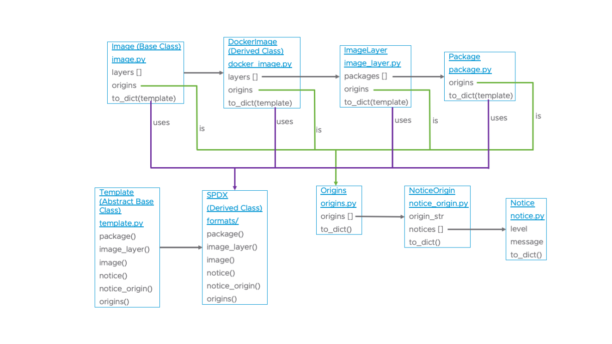

# Tern's Data Model

Tern stores metadata about the image and messages during operation in objects described here. The overall data model looks like this:

The main class is `Image` and its derived classes. This class contains a list of type `ImageLayer`. `ImageLayer` contains a list of type `Package`. `Image`, `ImageLayer` and `Package` contain a property called `origins` which is an object of type `Origins`. This class is used to record notes while Tern operates on an image such as what tools were used to retrieve the metadata or if the filesystem is of unknown content. `Origins` contains a list of type `NoticeOrigin` which contains a string and a list of type `Notice`. The `Notice` objects are where messages get recorded. You can easily record a message in the `origins` property of the `Image`, `ImageLayer` and `Package` types of objects by using the `add_notice_to_origins` method which just adds a `Notice` object to the `NoticeOrigin` object containing the origin string you give it ("origin_str" is basically a string indicating where in the image or analysis stage an event that you want recorded occurred).

You will also see a class called `Template`. This is an abstract base class used to make custom formats. To learn more see the [documentation on creating custom formats](./creating-custom-templates.md).

[Back to the README](../README.md)
